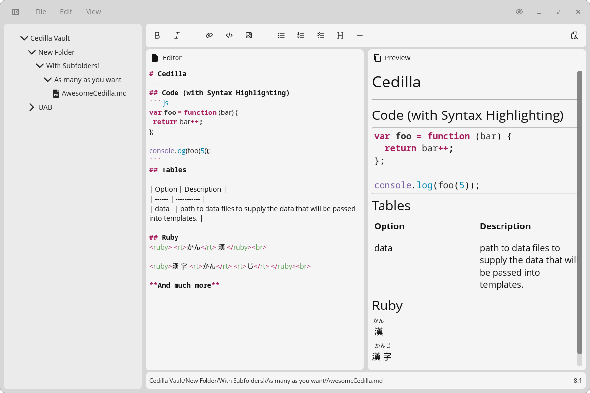
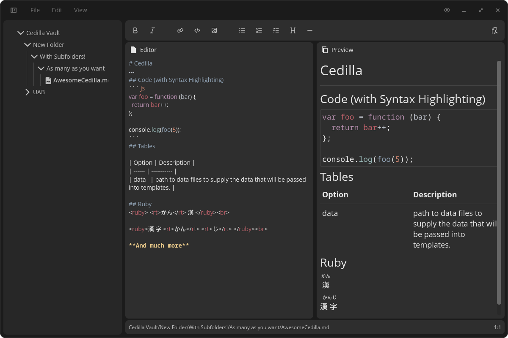

<div align="center">
<br>

<h1 align="center">Cedilla</h1>

<!--


-->

<h3>A markdown text editor for the COSMIC™ desktop</h3>





<br><br>

<!--<a href="https://flathub.org/apps/dev.mariinkys.Cedilla">
   
 </a>-->
 </div>

## Note

This is a WIP project that will be released, eventually.


## Install

To install your COSMIC application, you will need [just](https://github.com/casey/just), if you're on Pop!\_OS, you can install it with the following command:

```sh
sudo apt install just
```

After you install it, you can run the following commands to build and install your application:

```sh
just build-release
sudo just install
```

## Attribution

> "[Pop Icons](http://github.com/pop-os/icon-theme)" by [System76](http://system76.com/) is licensed under [CC-SA-4.0](http://creativecommons.org/licenses/by-sa/4.0/)

> For Markdown and HTML rendering this app uses the amazing work of [Mrmayman](https://github.com/Mrmayman) with [Frostmark](https://github.com/Mrmayman/frostmark). (Adapted to work with libcosmic and other changes/improvments by me)

## Copyright and Licensing

Copyright 2026 © Alex Marín

Released under the terms of the [GPL-3.0](./LICENSE)
